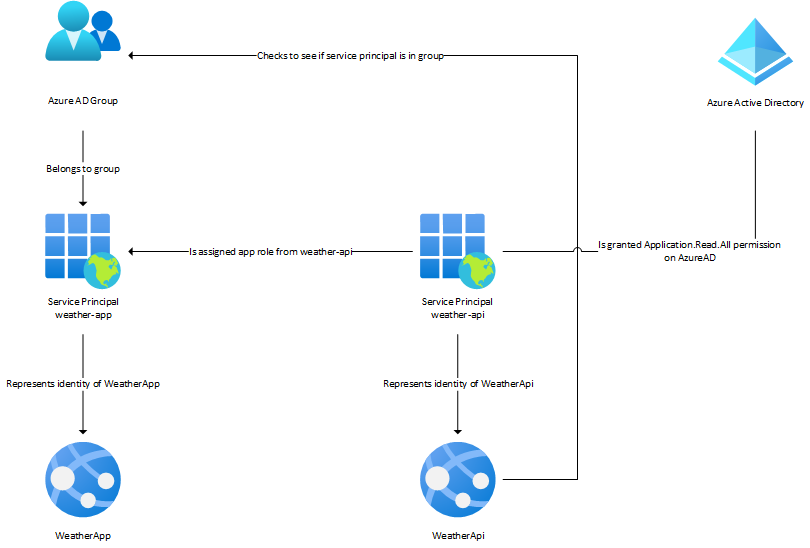
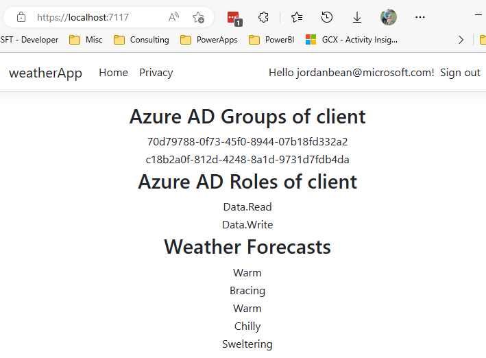

# client-credentials-graph-attribute



This repo demonstrates how to set up 2 Azure AD (AAD) service principals so that the front-end Razor Pages app can authenticate to the backend API to get weather data as itself (no signed in user necessary). This is done via [Client Credential Flow](https://learn.microsoft.com/en-us/azure/active-directory/develop/v2-oauth2-client-creds-grant-flow). It also demonstrates how to get the list of AAD groups the caller service principal is in via the Microsoft Graph API and add them to the identity object in the API.

This app implements a custom [IClaimsTransformation](https://learn.microsoft.com/en-us/aspnet/core/security/authentication/claims?view=aspnetcore-7.0#extend-or-add-custom-claims-using-iclaimstransformation) class (`src/weatherApi/Services/MicrosoftGraphClaimsTransformationService.cs`) to add additional group membership claims to the token. In this case, we can't use the default `groups` optional claim from AAD because the client caller is a service principal, not an interactive user.

These additional claims are validated via custom ASP.NET Core [Policy-based authorization](https://learn.microsoft.com/en-us/aspnet/core/security/authorization/policies?view=aspnetcore-7.0) (`src/weatherApi/Program.cs`) and the `Authorize` attribute (`src/weatherApi/Controllers/WeatherForecastController.cs`).

## Disclaimer

**THE SOFTWARE IS PROVIDED "AS IS", WITHOUT WARRANTY OF ANY KIND, EXPRESS OR IMPLIED, INCLUDING BUT NOT LIMITED TO THE WARRANTIES OF MERCHANTABILITY, FITNESS FOR A PARTICULAR PURPOSE AND NONINFRINGEMENT. IN NO EVENT SHALL THE AUTHORS OR COPYRIGHT HOLDERS BE LIABLE FOR ANY CLAIM, DAMAGES OR OTHER LIABILITY, WHETHER IN AN ACTION OF CONTRACT, TORT OR OTHERWISE, ARISING FROM, OUT OF OR IN CONNECTION WITH THE SOFTWARE OR THE USE OR OTHER DEALINGS IN THE SOFTWARE.**

## Prerequisites

- [dotnet cli](https://learn.microsoft.com/en-us/dotnet/core/tools/)

## AzureAD setup for WeatherApi

You will need to create an Azure AD app registration & service principal for the WeatherApi to use.

1.  Follow the instructions below to set up an identity in Azure AD.

    - [Register an application with the Microsoft identity platform](https://docs.microsoft.com/en-us/azure/active-directory/develop/quickstart-register-app)

1.  On the `API permissions` blade, add the following permissions (note that you will need to request admin consent for this permission):

    - `Microsoft Graph` -> `Application permissions` -> `Application.Read.All`

1.  On the `Expose an API` blade, `set` the Application ID URI. This will be used to create the `aud` claim in the JWT token.

1.  On the `App roles` blade, create the `Data.Read` and `Data.Write` roles. These will be used to create the `roles` claim in the JWT token.

## AzureAD setup for WeatherApp

You will need to create an Azure AD app registration & service principal for the WeatherApp to use.

1.  Follow the instructions below to set up an identity in Azure AD.

    - [Register an application with the Microsoft identity platform](https://docs.microsoft.com/en-us/azure/active-directory/develop/quickstart-register-app)

1.  On the `API permissions` blade, add the following permissions:

    - `WeatherApi` -> `Application permissions` -> `Data.Read`
    - `WeatherApi` -> `Application permissions` -> `Data.Write`

## Assign AAD app roles & groups to the WeatherApp service principal

1.  On the `Groups` blade, create 2 groups and add the `WeatherApp` service principal to each group. Note the `objectId` of each one.

    - `WeatherApp-DataRead`
    - `WeatherApp-DataWrite`

1.  On the `Enterprise Applications` blade, find the `weather-api` service principal and click on it.

1.  On the `Users and groups` blade, assign the `Data.Read` and `Data.Write` roles to the `WeatherApp` service principal.

1.  On the `Users and groups` blade, assign the `WeatherApp-DataRead` and `WeatherApp-DataWrite` groups to the respective `WeatherApp` service principal roles.

## Update the WeatherApi appsettings.json

1.  In the `src/WeatherApi/appsettings.json` file, update the following sections.

  - AzureAd
  - MicrosoftGraph
  - AzureAdGroups
  - AzureAdRoles

1. In the `src/WeatherApp/appsettings.json` file, update the following sections.

  - AzureAd
  - WeatherApi

## Run the apps

1.  Run the following commands to build and run the apps.

    ```shell
    dotnet run --project src/WeatherApi
    dotnet run --project src/WeatherApp
    ```

1.  Navigate to the URL to see the results.

    - [https://localhost:7117/](https://localhost:7117/)



## Links

- [Extend or add custom claims using IClaimsTransformation](https://learn.microsoft.com/en-us/aspnet/core/security/authentication/claims?view=aspnetcore-7.0#extend-or-add-custom-claims-using-iclaimstransformation)
- [Configuring optional claims](https://learn.microsoft.com/en-us/azure/active-directory/develop/active-directory-optional-claims#configuring-optional-claims)
- [Policy-based authorization in ASP.NET](https://learn.microsoft.com/en-us/aspnet/core/security/authorization/policies?view=aspnetcore-7.0)
- [Client credential flow](https://learn.microsoft.com/en-us/azure/active-directory/develop/v2-oauth2-client-creds-grant-flow)